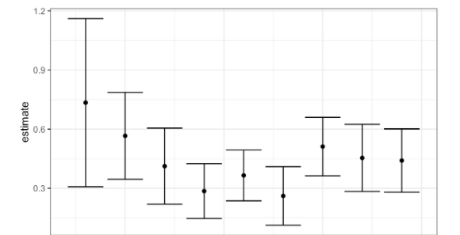

```{r setup, include=FALSE}
knitr::opts_chunk$set(echo = TRUE)
```

**NAME: Nicholas Tolley**\
**DUE DATE: March 21th, 6:00pm**

## Problem 1 (100 pts)

In the folder Assignment 3, you will find the data set called FF_wave6_2020v2.dta. This data set is from the Fragile Family Data Set, and it includes many different variables (socio-demographic, economics, and health status) of teenagers (15 years old) and their parents. The codebook (ff_wave6_codebook.txt) associated with the data set is on Canvas (folder Assignment 3).

Loading the dataset:

```{r}
rm(list=ls())
library(plyr)
library(readr)
library(dplyr)
library(glmnet)
library(haven)
set.seed(1)

df<read_dta(file='FF_wave6_2020v2.dta')
```

(a) (20 points) Consider the variable *doctor diagnosed youth with depression/anxiety*. In the data set, the name of this variable is *p6b5*. Then consider in the data set these variables: *p6b10*, *p6b35*, *p6b55*, *p6b60*, *p6c21*, *p6f32*, *p6f35*, *p6h74*, *p6h102*, *p6i7*, *p6i8*, *p6i11*, *p6j37*, *k6b21a*, *k6b22a*, *k6c1*, *k6c4e*, *k6c28*, *k6d37*, *k6f63*, *ck6cbmi*, *k6d10*. Now, you have a data set with 4898 subjects and 23 variables. Clean the data in these three steps. 1- Each variable has a value with a number and a text (for example, a value for the variable *p6b5* is *2 No*). Remove the text from all the variables in the data set (hint: use the function sub for each column). 2- Transform each variable in numeric (hint: use the function as.numeric for each column). 3- Transform all the values less than 0 in NA and then remove all your NA values from the data set. Show the dimensions of the cleaned data and print the first 6 rows.

Step 1)

```{r}

```

(a) (20 points) Now call the variables with an appropriate name (for example *p6b5* can become *Depression*). Perform a logistic regression using the variable *Depression* as the outcome and the remaining variables as the covariates. Be careful: the variable *Depression* has value 1 and 2, you should transform in 0,1 before running the logistic regression in R (1 for Yes, 0 for No). What are the important and significant covariates for the depression? For these, what can you say about the standard error? Perform the binned residual plot by using the library ggplot2 in R. Then write a function in R that gives the odds ratio for each beta and its upper and lower confidence intervals (CI). Use this function to produce the beta coefficient related to the covariate (ADD or *p6b10*), and its CI in term of ODDS RATIO. What can you say about that? Is still significant?

(b) (20 points) Use the forward step procedure to detect the important covariates. Then, only for estimates that are greater than 0, draw with ggplot a plot similar to Figure 1. So in the x-axis, you should have each beta (beta1, beta2, etc.). In the y-axis, the estimate greater than 0 with the correspondent standard error. Be careful this plot is taken from another data set, so do not expect similar results. Take special care of the legend and the label. What can you say about this plot?

```{r}
fit1 <- lm(earn~., data=drop_na(df))
fit2 <- lm(earn~1, data=drop_na(df))
mod_backward <- stepAIC(fit1, direction="backward", scope=list(upper=fit1, lower=fit2))
summary(mod_backward)
```

```{r, out.width="0.5\\linewidth", include=TRUE, fig.align="center", fig.cap=c("Estimate"), echo=FALSE}

```

(d) (20 points) Perform a bootstrap of 1000 samples for beta 1 (ADD or *p6b10*), beta 2 (sleep or *p6b55*), and beta 3 (attention at school or *k6b21a*) with a model that contains all the coefficients obtained in the forward procedure in point c. Plot these three bootstrapped beta coefficients that you have obtained with a boxplot in the ggplot (similar to Figure 2). (make sure not to use the default colors but rather choose your own). What can you say about these three distributions obtained?

```{r}
fc <- function(d, i){
  d2 <- d[i,]
  boot_fit <- lm(earn ~ height + male + education + tense + age, data=d2)
  
  return(boot_fit[['coefficients']])
}

earn_boot <- boot(drop_na(df), fc, R=500)
```

```{r, out.width="0.6\\linewidth", include=TRUE, fig.align="center", fig.cap=c("Boxplot"), echo=FALSE}
knitr::include_graphics("Fig2.pdf")
```

(e) (20 points) Perform the Lasso method for the full model. Choose $\lambda$ with the cross-validation. Then perform the lasso with the best $\lambda$ obtained. Plot the results in ggplot. Describe the results you obtained. Are the coefficients obtained with the lasso procedure similar to the coefficients obtained with the forward procedure? Explain!

```{r}
lasso_mod = glmnet(x_train, 
                   y_train, 
                   alpha = 1, 
                   lambda = grid)

plot(lasso_mod)

##CV 
set.seed(1)
# Fit lasso model on training data
cv.out = cv.glmnet(x_train, y_train, alpha = 1) 

# Select lambda that minimizes training MSE
bestlam = cv.out$lambda.min 

# Fit lasso model on full dataset
out = glmnet(x, y, alpha = 1, lambda = grid) 

# Display coefficients using lambda chosen by CV
lasso_coef = predict(out, type = "coefficients", s = bestlam)[1:20,] 
lasso_coef
lasso_mod <-  glmnet(x, y, alpha = 1)
```
